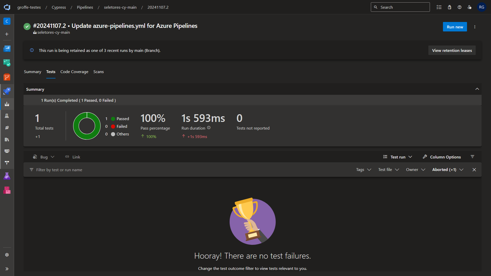
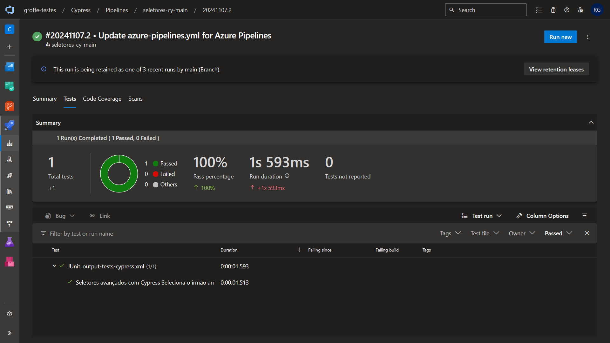
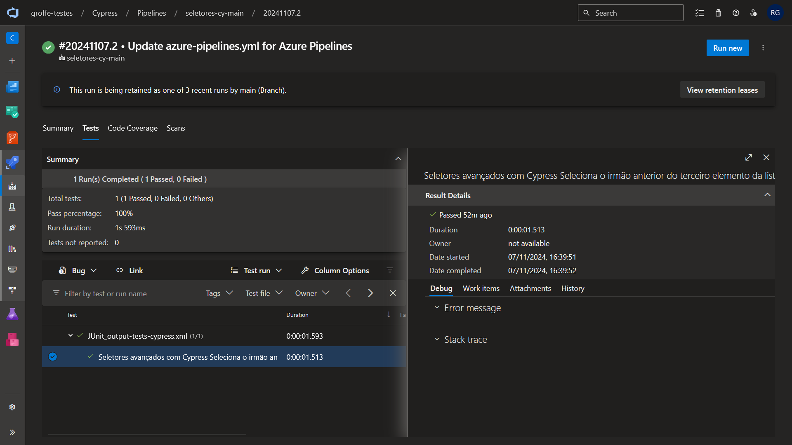

# Cypress-JUnitReport-AzureDevOps-Pipeline
Pipeline do Azure DevOps para execução automatizada de testes do Cypress, com exportação dos resultados para uma arquivo XML padrão JUnit (e publicação nos resultados da execução).

Agradeço ao amigo **Fabio Araujo** pelo apoio com dúvidas e pelo exemplo fornecido para que eu criasse esta automação. O repositório está em: https://github.com/fabioaraujoqa/seletores-cy

---

## Resultados da execução

Sucesso na execução dos testes:

Resumo do teste que passou:

Detalhes sobre o teste que apresentou sucesso:

